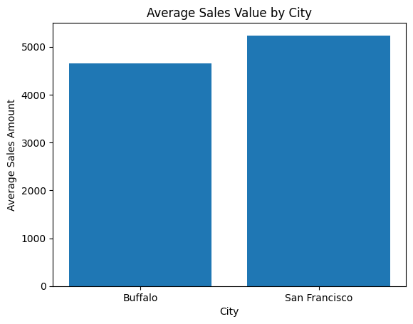

# Retail Sales Analysis: City-Level Comparison

## 📌 Project Overview
This project explores a retail sales dataset to compare sales performance between different cities, with a focused comparison between **Buffalo** and **San Francisco**. The analysis demonstrates foundational data analytics skills using Python and pandas, including data exploration, aggregation, and visualization.

The project was designed as an exploratory analysis to understand transaction volume and average sales value across locations.

---

## 🎯 Objectives
- Load and explore a retail sales dataset
- Understand the structure and key variables
- Compare sales activity between cities
- Analyze differences in average sales value
- Visualize insights using a simple bar chart

---

## 🛠️ Tools & Technologies
- **Python**
- **pandas** for data manipulation
- **NumPy** for numerical operations
- **matplotlib** for data visualization
- **Jupyter Notebook**

---

## 📊 Key Findings

### Sales Volume
- **Buffalo** recorded **90 transactions**
- **San Francisco** recorded **84 transactions**

Buffalo showed a slightly higher number of transactions in this dataset.

---

### Average Sales Value
- **Buffalo:** approximately **4,650** per transaction  
- **San Francisco:** approximately **5,238** per transaction

Although Buffalo had marginally higher transaction volume, San Francisco demonstrated a higher average sales value per transaction, suggesting stronger revenue generation per sale.

---

## 📈 Visualization
The bar chart below illustrates the difference in average sales value between Buffalo and San Francisco.



*Note: The visualization was saved as an image file due to non-interactive plotting.*

---

## 📂 Project Structure
```
retail-sales-analysis/
|– data/
|   |– retail_sales.csv
|
|– notebook/
|   |– retail_sales_analysis.ipynb
|
|– average_sales_by_city.png
|– README.md
|-- .gitignore

```
---

## 🚀 How to Run the Project
1. Clone the repository
2. Install required libraries:
   ```bash
   pip install pandas numpy matplotlib
   ```
3. Launch Jupyter Notebook:
   ```
   python -m notebook
   ```
4. Open the notebook and run all cells from top to bottom.

📌 Notes & Future Work

This project focuses on exploratory analysis and foundational techniques. Potential future improvements include:

	•	Revenue aggregation by city
	•	Time-based trend analysis
	•	Additional visualizations
	•	Data validation and cleaning

## 👤 Author
Troy Sithole


